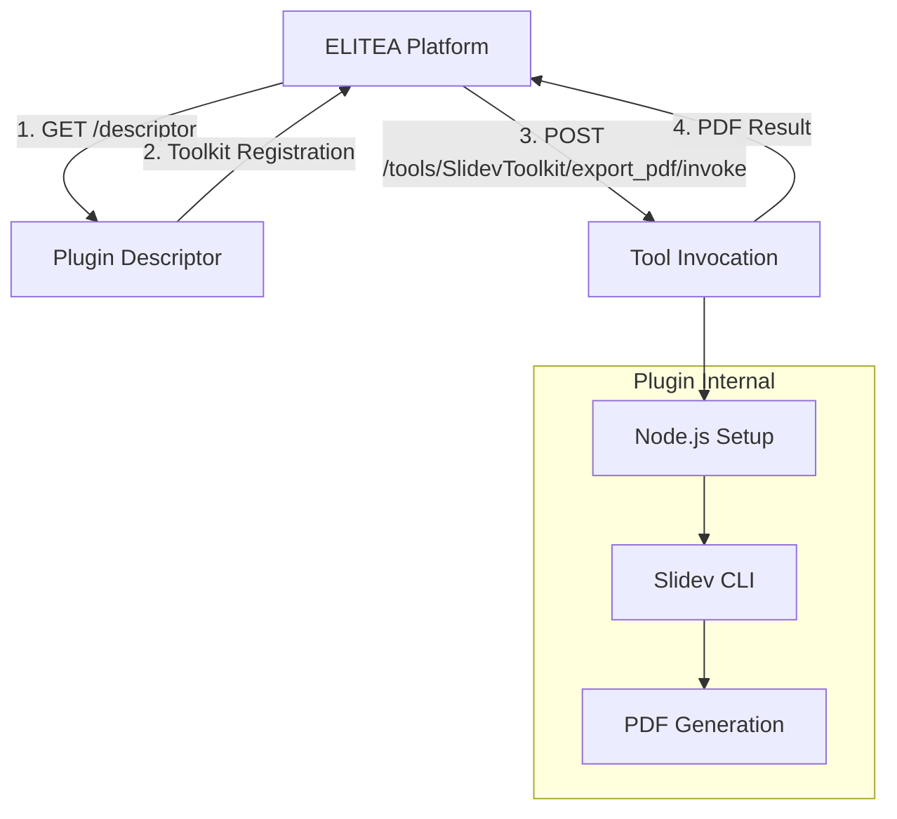

# ELITEA/Pylon Slidev Integration Plugin

This repository contains a reference implementation of an ELITEA/Pylon integration plugin for Slidev (web-based slide maker and presenter). This serves as both a working integration and a comprehensive example for creating similar plugins.

## 📚 Documentation

This repository includes comprehensive documentation for creating ELITEA/Pylon integration plugins:

- **[Step-by-Step Guide](STEP_BY_STEP_GUIDE.md)** - 🎯 **START HERE** - Complete walkthrough building an image processing plugin from scratch
- **[Integration Guide](INTEGRATION_GUIDE.md)** - Complete guide covering architecture, components, and implementation
- **[Quick Start Template](QUICK_START_TEMPLATE.md)** - Minimal working template to get started quickly  
- **[Integration Patterns](INTEGRATION_PATTERNS.md)** - Common patterns for different types of tool integrations

## 🏗️ Architecture Overview

The Slidev integration demonstrates the standard ELITEA/Pylon plugin architecture:



## 🚀 What This Plugin Does

The Slidev plugin:
1. **Downloads and sets up Node.js** runtime environment
2. **Installs Slidev CLI** and required packages (Playwright, themes)
3. **Exposes `export_pdf` tool** that converts Markdown slides to PDF
4. **Registers with ELITEA platform** via descriptor endpoint

## 📁 Project Structure

```
slidev_host/
├── metadata.json              # Plugin metadata for Pylon
├── config.yml                 # Configuration defaults
├── module.py                  # Main Pylon module
├── methods/                   # Internal plugin methods
│   ├── init.py               # Initialization logic
│   ├── config.py             # Configuration management
│   └── binaries.py           # Node.js/Slidev setup
└── routes/                   # HTTP endpoints
    ├── descriptor.py         # Toolkit registration
    ├── invoke.py             # Tool invocation
    ├── invocations.py        # Status checking
    └── health.py             # Health check
```

## 🔧 Key Components

### Descriptor (`routes/descriptor.py`)
Registers the `SlidevToolkit` with one tool:
- **`export_pdf`** - Converts Markdown slides to PDF
- Input: `slides_md` (String) - Markdown content
- Output: Base64-encoded PDF

### Tool Invocation (`routes/invoke.py`)
Handles the PDF export process:
1. Validates input parameters
2. Creates temporary workspace
3. Writes Markdown to file
4. Executes Slidev CLI with proper Node.js environment
5. Returns generated PDF as base64

### Environment Setup (`methods/binaries.py`)
Manages Node.js and Slidev installation:
- Downloads Node.js binary for Linux
- Extracts and sets up Node.js environment
- Installs required npm packages (Slidev CLI, Playwright, themes)

## 🛠️ Configuration

The plugin supports configuration via `config.yml`:

```yaml
base_path: /data/slidev          # Data directory
node_version: v22.16.0           # Node.js version
service_location_url: http://127.0.0.1:8080  # Plugin service URL
```

## 📋 API Endpoints

### Descriptor
```
GET /descriptor
```
Returns toolkit registration information.

### Tool Invocation
```
POST /tools/SlidevToolkit/export_pdf/invoke
Content-Type: application/json

{
  "parameters": {
    "slides_md": "# My Presentation\n\n---\n\n## Slide 2\nContent here"
  }
}
```

### Health Check
```
GET /health
```
Returns plugin health status and uptime.

## 🔄 Using This as a Reference

This implementation demonstrates several common patterns:

1. **External Binary Management** - Downloading, extracting, and managing Node.js
2. **Package Installation** - Installing npm packages dynamically
3. **Environment Setup** - Managing PATH and environment variables
4. **Temporary Workspace** - Creating and cleaning up work directories
5. **Error Handling** - Proper error responses and cleanup
6. **Configuration Management** - Flexible configuration with defaults

## 📖 Creating Your Own Plugin

**New to ELITEA/Pylon plugins?** Follow these steps:

### 🚀 Quick Start with Template

1. **🎯 [Use the Template Repository](https://github.com/your-org/elitea-pylon-plugin-template)**
   - Click "Use this template" → Create new repository
   - Clone your new repository locally
   - Run `python setup_template.py` for guided setup

2. **📚 Learn with Step-by-Step Guide**
   - **🚀 [Start with the Step-by-Step Guide](STEP_BY_STEP_GUIDE.md)** - Build a complete image processing plugin from scratch

3. **📋 Reference Documentation**
   - **⚡ Use the [Quick Start Template](QUICK_START_TEMPLATE.md)** for a minimal working example
   - **📋 Study the [Integration Patterns](INTEGRATION_PATTERNS.md)** for your specific tool type
   - **📖 Reference the [Integration Guide](INTEGRATION_GUIDE.md)** for comprehensive implementation details
   - **🔍 Use this Slidev implementation** as a reference for complex setups

### 🛠️ Template Repository Features

The template repository provides:
- **🎯 Interactive Setup** - Guided configuration for your specific tool
- **🧪 Built-in Testing** - Comprehensive test suite 
- **📁 Complete Structure** - All files with proper placeholders
- **📚 Documentation** - Links to guides and examples

## 🤝 Common Integration Types

The documentation covers patterns for:
- **Python libraries** (PIL, pandas, etc.)
- **CLI tools** (FFmpeg, ImageMagick, etc.)
- **Node.js tools** (like this Slidev example)
- **REST APIs** (external services)
- **Databases** (SQL processing)
- **Machine Learning models** (TensorFlow, etc.)

## 📝 License

Licensed under the Apache License, Version 2.0. See [LICENSE](LICENSE) for details.

---

**Need help?** Check the documentation files or study this implementation as a working example of ELITEA/Pylon plugin development.
