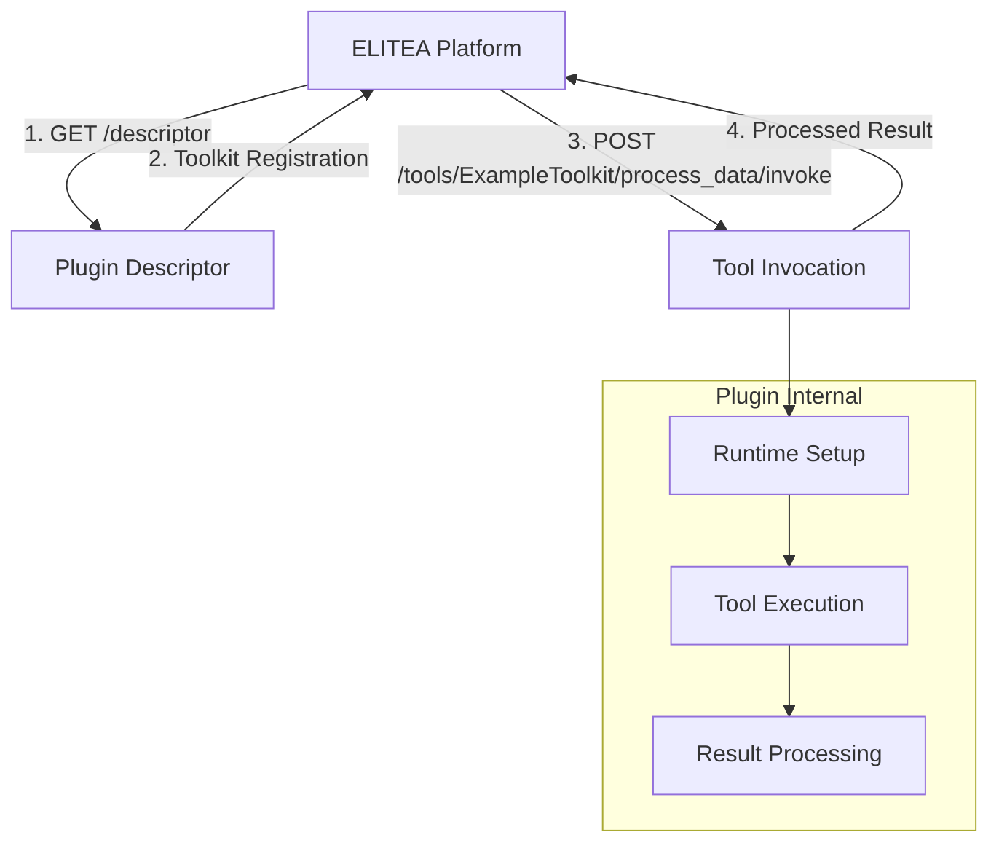

# ELITEA/Pylon Integration Plugin Template

This repository serves as a template and reference implementation for creating ELITEA/Pylon integration plugins for Node.js and Python modules. It provides comprehensive examples and documentation for integrating external tools and libraries.

## 📚 Documentation

This repository includes comprehensive documentation for creating ELITEA/Pylon integration plugins:

### 🚀 Getting Started
- **[Step-by-Step Guide](docs/STEP_BY_STEP_GUIDE.md)** - 🎯 **START HERE** - Complete walkthrough building an image processing plugin from scratch
- **[Quick Start Template](docs/QUICK_START_TEMPLATE.md)** - Minimal working template to get started quickly

### 📖 Reference Documentation  
- **[Integration Guide](docs/INTEGRATION_GUIDE.md)** - Complete guide covering architecture, components, and implementation
- **[Integration Patterns](docs/INTEGRATION_PATTERNS.md)** - Common patterns for different types of tool integrations

### 🛠️ Template Setup
- **[Template README](docs/TEMPLATE_README.md)** - How to use this repository as a template for new plugins
- **[Template Setup Instructions](docs/TEMPLATE_SETUP_INSTRUCTIONS.md)** - Creating the template repository structure

> **📋 Documentation Index**: See [docs/DOCUMENTATION_INDEX.md](docs/DOCUMENTATION_INDEX.md) for complete navigation guide

## 🏗️ Architecture Overview

This template demonstrates the standard ELITEA/Pylon plugin architecture:



## 🚀 What This Template Provides

This template includes:
1. **Runtime environment setup** (Node.js, Python packages)
2. **Dependency management** and installation
3. **Generic tool exposure** that can be customized for any tool
4. **Registration with ELITEA platform** via descriptor endpoint

## 📁 Project Structure

```
integration_template/
├── README.md                   # This file
├── setup_template.py          # Template customization script
├── test_plugin.py             # Plugin testing utility
├── data/                      # Schema and configuration files
│   ├── epam_ai_run_spi.json
│   ├── epam_ai_run.spi.schema.json
│   └── ExternalServiceProviderDescriptor.json
└── docs/                      # Comprehensive documentation
    ├── DOCUMENTATION_INDEX.md     # Navigation guide
    ├── INTEGRATION_GUIDE.md       # Complete reference
    ├── INTEGRATION_PATTERNS.md    # Common patterns
    ├── QUICK_START_TEMPLATE.md    # Minimal template
    ├── STEP_BY_STEP_GUIDE.md     # Detailed walkthrough
    ├── TEMPLATE_README.md         # Template usage guide
    └── TEMPLATE_SETUP_INSTRUCTIONS.md
```

## 🔧 Template Components

### Setup Script (`setup_template.py`)
Interactive plugin generation that:
- Prompts for plugin details and tool specifications
- Generates customized plugin files with proper structure
- Creates placeholder methods for your specific tools
- Sets up proper metadata and configuration

### Testing Utility (`test_plugin.py`)
Comprehensive test suite for validating plugins:
- Health check verification
- Descriptor endpoint testing
- Tool invocation testing with sample data
- Status endpoint validation

### Documentation Structure
Complete guides for different experience levels:
- **Quick Start**: Get running in 5 minutes
- **Step-by-Step**: Learn by building a complete example
- **Patterns**: Reference implementations for common tool types
- **Reference**: Complete API and architecture documentation

## 🏗️ Plugin Architecture Patterns

### Python Library Integration
Shows how to integrate Python packages:
- Package installation and dependency management
- Direct Python library usage in tool methods
- Error handling and result formatting

### Node.js Module Integration  
Demonstrates Node.js tool integration:
- Runtime environment setup and management
- NPM package installation and execution
- Environment variable and PATH configuration

### CLI Tool Integration
Examples for wrapping command-line tools:
- Binary download and installation
- Process execution with proper environment
- Input/output handling and error management

## 🛠️ Configuration

The template supports configuration for different integration types:

### Python Library Plugins
```yaml
# Example config.yml for Python-based plugins
base_path: /tmp/plugin_workspace
python_packages:
  - "Pillow>=9.0.0"
  - "requests>=2.25.0"
service_location_url: http://127.0.0.1:8080
```

### Node.js Module Plugins  
```yaml
# Example config.yml for Node.js-based plugins  
base_path: /tmp/plugin_workspace
node_version: v20.0.0
npm_packages:
  - "puppeteer"
  - "express"
service_location_url: http://127.0.0.1:8080
```

## 📋 API Endpoints

### Descriptor
```
GET /descriptor
```
Returns toolkit registration information with available tools.

### Tool Invocation
```
POST /tools/{ToolkitName}/{tool_name}/invoke
Content-Type: application/json

{
  "parameters": {
    "param1": "value1",
    "param2": "value2"
  }
}
```

### Health Check
```
GET /health
```
Returns plugin health status and uptime.

## 🔄 Using This as a Reference

This template demonstrates several common integration patterns:

1. **Runtime Environment Management** - Setting up Python/Node.js environments
2. **Package Installation** - Installing Python packages and npm modules
3. **Environment Configuration** - Managing PATH and environment variables  
4. **Temporary Workspace** - Creating and cleaning up work directories
5. **Error Handling** - Proper error responses and cleanup
6. **Configuration Management** - Flexible configuration with defaults

## 📖 Creating Your Own Plugin

**New to ELITEA/Pylon plugins?** Choose your path:

### 🏃‍♂️ Quick Start (5 minutes)
1. **⚡ [Use the Quick Start Template](docs/QUICK_START_TEMPLATE.md)** - Minimal working example
2. **🧪 Test with the setup script**: `python setup_template.py`

### 📚 Learn by Building (30 minutes)
1. **🎯 [Follow the Step-by-Step Guide](docs/STEP_BY_STEP_GUIDE.md)** - Build a complete image processing plugin from scratch
2. **📋 Study [Integration Patterns](docs/INTEGRATION_PATTERNS.md)** - Find patterns for your specific tool type

### 🔧 Template for Production
1. **📦 [Use as Template Repository](docs/TEMPLATE_README.md)** - Create new plugins from this template
2. **📖 Reference the [Integration Guide](docs/INTEGRATION_GUIDE.md)** - Comprehensive implementation details
3. **🔍 Use this template implementation** as a reference for complex setups

### 🛠️ Template Repository Features

The template repository provides:
- **🎯 Interactive Setup** - Guided configuration with `python setup_template.py`
- **🧪 Built-in Testing** - Comprehensive test suite with `python test_plugin.py`
- **📁 Complete Structure** - All files with proper placeholders
- **📚 Documentation** - Links to guides and examples

## 🤝 Common Integration Types

The documentation covers patterns for:
- **🐍 Python libraries** (PIL, pandas, scikit-learn)
- **🛠️ CLI tools** (FFmpeg, ImageMagick, Pandoc)
- **🌐 Node.js modules** (Puppeteer, Express, etc.)
- **📊 REST APIs** (external services)
- **🗄️ Databases** (SQL processing)
- **🤖 Machine Learning models** (TensorFlow, PyTorch)

## 📝 License

Licensed under the Apache License, Version 2.0. See [LICENSE](LICENSE) for details.

---

**Need help?** Check the documentation files or study this implementation as a working example of ELITEA/Pylon plugin development.
