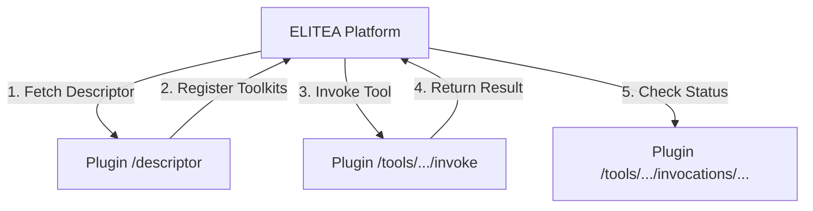

# ELITEA/Pylon Integration Plugin Development Guide

This comprehensive reference guide explains how to create integration plugins for the ELITEA platform using the Pylon framework. The Slidev integration in this repository serves as a reference implementation for integrating external tools and systems.

> **💡 Quick Start**: New to plugin development? Start with the [Step-by-Step Guide](STEP_BY_STEP_GUIDE.md) or [Quick Start Template](QUICK_START_TEMPLATE.md).
> 
> **🔍 Looking for patterns?** Check [Integration Patterns](INTEGRATION_PATTERNS.md) for specific tool types.

## Table of Contents
1. [Architecture Overview](#architecture-overview)
2. [Project Structure](#project-structure)
3. [Core Components](#core-components)
4. [Implementation Steps](#implementation-steps)
5. [Python Plugin Example](#python-plugin-example)
6. [Node.js Plugin Example](#nodejs-plugin-example)
7. [API Specification](#api-specification)
8. [Best Practices](#best-practices)

## Architecture Overview

The ELITEA/Pylon integration follows a service provider pattern where:

1. **Plugin Registration**: The plugin exposes a descriptor endpoint that registers toolkits and their functions with the platform
2. **Tool Invocation**: The platform calls the plugin through standardized HTTP endpoints
3. **Internal Setup**: The plugin manages its own dependencies and runtime environment
4. **Result Handling**: The plugin returns results in a standardized format



## Project Structure

```
plugin_name/
├── __init__.py                 # Module initialization
├── module.py                   # Main Pylon module
├── metadata.json              # Plugin metadata
├── config.yml                 # Configuration defaults
├── requirements.txt           # Python dependencies
├── methods/                   # Internal plugin methods
│   ├── __init__.py
│   ├── init.py               # Initialization logic
│   ├── config.py             # Configuration management
│   └── binaries.py           # External tool setup
└── routes/                   # HTTP endpoints
    ├── __init__.py
    ├── descriptor.py         # Toolkit registration
    ├── invoke.py             # Tool invocation
    ├── invocations.py        # Status checking
    └── health.py             # Health check
```

## Core Components

### 1. Module Definition (`module.py`)

The main Pylon module that initializes the plugin:

```python
from pylon.core.tools import module

class Module(module.ModuleModel):
    def init(self):
        self.descriptor.init_all(
            url_prefix="/",
            static_url_prefix="/",
        )
```

### 2. Metadata (`metadata.json`)

Plugin metadata for the Pylon framework:

```json
{
  "name": "Host for tools: your_tool",
  "version": "0.1",
  "depends_on": [],
  "init_after": []
}
```

### 3. Configuration (`config.yml`)

Default configuration values:

```yaml
base_path: /data/your_tool
tool_version: v1.0.0
service_location_url: http://127.0.0.1:8080
```

## Implementation Steps

### Step 1: Create Plugin Structure

1. Create the directory structure as shown above
2. Set up `__init__.py` files in each package
3. Define your plugin metadata in `metadata.json`

### Step 2: Implement Core Routes

#### Descriptor Route (`routes/descriptor.py`)

This is the most critical component - it registers your toolkit with the platform:

```python
from pylon.core.tools import web

class Route:
    @web.route("/descriptor")
    def descriptor_route(self):
        service_location_url = self.descriptor.config.get(
            "service_location_url", "http://127.0.0.1:8080"
        )
        
        return {
            "name": "YourServiceProvider",
            "service_location_url": service_location_url,
            "configuration": {},
            "provided_toolkits": [
                {
                    "name": "YourToolkit",
                    "description": "Description of your toolkit",
                    "toolkit_config": {
                        "type": "Your Tool Configuration",
                        "description": "Configuration for your tool",
                        "parameters": {},
                    },
                    "provided_tools": [
                        {
                            "name": "your_function",
                            "args_schema": {
                                "input_param": {
                                    "type": "String",
                                    "required": True,
                                    "description": "Description of input parameter"
                                }
                            },
                            "description": "Description of what this tool does",
                            "tool_metadata": {
                                "result_target": "artifact",  # or "inline"
                                "result_extension": "pdf",    # if applicable
                                "result_encoding": "base64",  # if applicable
                            },
                            "tool_result_type": "String",
                            "sync_invocation_supported": True,
                            "async_invocation_supported": False,
                        },
                    ],
                    "toolkit_metadata": {},
                },
            ]
        }
```

#### Invoke Route (`routes/invoke.py`)

Handles tool execution requests:

```python
import flask
from pylon.core.tools import web, log

class Route:
    @web.route("/tools/<toolkit_name>/<tool_name>/invoke", methods=["POST"])
    def invoke_route(self, toolkit_name, tool_name):
        # Validate toolkit and tool names
        if toolkit_name != "YourToolkit" or tool_name != "your_function":
            return {
                "errorCode": "404",
                "message": "Resource Not Found",
                "details": [],
            }, 404
        
        try:
            request_data = flask.request.json
            
            # Validate required parameters
            if "parameters" not in request_data:
                return {
                    "errorCode": "400",
                    "message": "Bad Request",
                    "details": ["Missing parameters"],
                }, 400
            
            # Extract parameters
            params = request_data["parameters"]
            
            # Execute your tool logic here
            result = self.execute_tool(params)
            
            # Return success response
            return {
                "invocation_id": str(uuid.uuid4()),
                "status": "Completed",
                "result": result,
                "result_type": "String",
            }
            
        except Exception as e:
            log.exception("Failed to invoke %s:%s", toolkit_name, tool_name)
            return {
                "errorCode": "500",
                "message": "Internal Server Error",
                "details": [str(e)],
            }, 500
```

#### Health Route (`routes/health.py`)

Provides health check endpoint:

```python
import time
import datetime
from pylon.core.tools import web

class Route:
    @web.route("/health")
    def health_route(self):
        return {
            "status": "UP",
            "providerVersion": "latest",
            "uptime": int(time.time() - self.start_ts),
            "timestamp": datetime.datetime.utcnow().strftime("%Y-%m-%dT%H:%M:%S+00:00"),
            "extra_info": {},
        }
```

### Step 3: Implement Configuration Management

#### Configuration Method (`methods/config.py`)

```python
import os
import pathlib
from pylon.core.tools import web

class Method:
    @web.method()
    def runtime_config(self):
        result = {}
        
        # Base configuration with defaults
        config_map = {
            "base_path": str(pathlib.Path(__file__).parent.parent.joinpath("data", "your_tool")),
            "tool_version": "v1.0.0",
            "url_verify": True,
        }
        
        # Override with user configuration
        for key, default in config_map.items():
            result[key] = self.descriptor.config.get(key, default)
        
        return result
```

### Step 4: Implement Initialization

#### Initialization Method (`methods/init.py`)

```python
import time
from pylon.core.tools import web

class Method:
    @web.init()
    def init(self):
        config = self.runtime_config()
        
        # Setup your tool environment
        self.setup_environment(config)
        
        # Track startup time for health checks
        self.start_ts = time.time()
    
    def setup_environment(self, config):
        # Implement your environment setup logic
        pass
```

## Python Plugin Example

Here's a complete example for a Python-based tool integration:

### Plugin for Python Image Processing Tool

```python
# routes/descriptor.py
class Route:
    @web.route("/descriptor")
    def descriptor_route(self):
        return {
            "name": "ImageProcessingProvider",
            "service_location_url": self.descriptor.config.get("service_location_url", "http://127.0.0.1:8080"),
            "configuration": {},
            "provided_toolkits": [{
                "name": "ImageToolkit",
                "description": "Image processing toolkit using PIL",
                "provided_tools": [{
                    "name": "resize_image",
                    "args_schema": {
                        "image_data": {"type": "String", "required": True, "description": "Base64 encoded image"},
                        "width": {"type": "Integer", "required": True, "description": "Target width"},
                        "height": {"type": "Integer", "required": True, "description": "Target height"}
                    },
                    "description": "Resize an image to specified dimensions",
                    "tool_result_type": "String",
                    "sync_invocation_supported": True,
                }],
            }]
        }

# routes/invoke.py
import base64
from PIL import Image
import io

class Route:
    @web.route("/tools/<toolkit_name>/<tool_name>/invoke", methods=["POST"])
    def invoke_route(self, toolkit_name, tool_name):
        if toolkit_name != "ImageToolkit" or tool_name != "resize_image":
            return {"errorCode": "404", "message": "Not Found"}, 404
        
        try:
            data = flask.request.json["parameters"]
            
            # Decode image
            image_bytes = base64.b64decode(data["image_data"])
            image = Image.open(io.BytesIO(image_bytes))
            
            # Resize
            resized = image.resize((data["width"], data["height"]))
            
            # Encode result
            output = io.BytesIO()
            resized.save(output, format='PNG')
            result_data = base64.b64encode(output.getvalue()).decode()
            
            return {
                "invocation_id": str(uuid.uuid4()),
                "status": "Completed",
                "result": result_data,
                "result_type": "String",
            }
        except Exception as e:
            return {"errorCode": "500", "message": str(e)}, 500

# requirements.txt
Pillow>=9.0.0
flask>=2.0.0
```

## Node.js Plugin Example

For Node.js-based tools, you'll need to manage Node.js installation and packages:

### Plugin for Node.js-based Tool

```python
# methods/binaries.py - Node.js setup
import subprocess
import os
from pylon.core.tools import web, process

class Method:
    @web.method()
    def setup_nodejs(self, config):
        node_path = config["node_path"]
        
        # Install required packages
        packages = ["express", "your-npm-package"]
        
        for package in packages:
            process.run_command([
                os.path.join(node_path, "npm"), "install", "-g", package
            ])

# routes/invoke.py - Execute Node.js tool
class Route:
    @web.route("/tools/<toolkit_name>/<tool_name>/invoke", methods=["POST"])
    def invoke_route(self, toolkit_name, tool_name):
        try:
            config = self.runtime_config()
            node_bin = config["node_bin"]
            
            # Prepare environment
            env = os.environ.copy()
            env["PATH"] = os.pathsep.join([env["PATH"], node_bin])
            
            # Execute Node.js script
            result = process.run_command([
                "node", "your-script.js"
            ], env=env, capture_output=True)
            
            return {
                "invocation_id": str(uuid.uuid4()),
                "status": "Completed",
                "result": result.stdout,
                "result_type": "String",
            }
        except Exception as e:
            return {"errorCode": "500", "message": str(e)}, 500
```

## API Specification

### Descriptor Response Format

```json
{
  "name": "ServiceProviderName",
  "service_location_url": "http://host:port",
  "configuration": {},
  "provided_toolkits": [
    {
      "name": "ToolkitName",
      "description": "Toolkit description",
      "toolkit_config": {
        "type": "Configuration Type",
        "description": "Configuration description",
        "parameters": {}
      },
      "provided_tools": [
        {
          "name": "tool_name",
          "args_schema": {
            "param_name": {
              "type": "String|Integer|Boolean|Object",
              "required": true|false,
              "description": "Parameter description"
            }
          },
          "description": "Tool description",
          "tool_metadata": {
            "result_target": "artifact|inline",
            "result_extension": "file_extension",
            "result_encoding": "base64|utf8"
          },
          "tool_result_type": "String|Integer|Boolean|Object",
          "sync_invocation_supported": true|false,
          "async_invocation_supported": true|false
        }
      ],
      "toolkit_metadata": {}
    }
  ]
}
```

### Invoke Request/Response Format

**Request:**
```json
{
  "parameters": {
    "param1": "value1",
    "param2": "value2"
  }
}
```

**Success Response:**
```json
{
  "invocation_id": "uuid",
  "status": "Completed|Running|Failed",
  "result": "result_data",
  "result_type": "String|Integer|Boolean|Object"
}
```

**Error Response:**
```json
{
  "errorCode": "400|404|500",
  "message": "Error message",
  "details": ["detail1", "detail2"]
}
```

## Best Practices

### 1. Error Handling
- Always wrap tool execution in try-catch blocks
- Return meaningful error messages and codes
- Log errors for debugging

### 2. Configuration Management
- Use configuration files for defaults
- Allow runtime configuration override
- Validate configuration parameters

### 3. Resource Management
- Clean up temporary files and resources
- Use context managers for file operations
- Implement proper error recovery

### 4. Security
- Validate all input parameters
- Sanitize file paths and commands
- Use secure defaults for network operations

### 5. Performance
- Cache expensive setup operations
- Use streaming for large data transfers
- Implement proper timeout handling

### 6. Testing
- Test descriptor endpoint registration
- Test tool invocation with various inputs
- Test error scenarios and edge cases

### 7. Documentation
- Document all parameters and return values
- Provide clear tool descriptions
- Include usage examples

## Deployment Considerations

1. **Dependencies**: Ensure all required dependencies are listed in `requirements.txt`
2. **Permissions**: Set appropriate file permissions for data directories
3. **Environment**: Configure environment variables for production
4. **Monitoring**: Implement logging and health checks
5. **Scaling**: Consider stateless design for horizontal scaling

This guide provides a comprehensive foundation for creating ELITEA/Pylon integration plugins. Use the Slidev implementation as a reference and adapt the patterns to your specific tool requirements.
